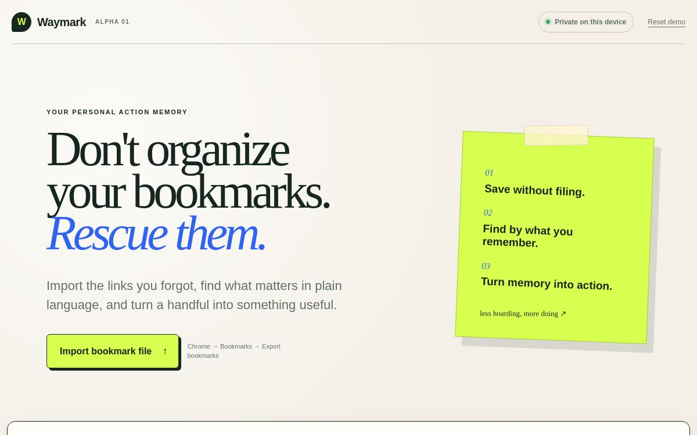

# Vikkypaedia Way to Bookmarks

> Don’t organize your bookmarks. Rescue them.

**Waymark** is a privacy-first personal action memory. It helps people recover
forgotten saves, search by what they remember, and turn a few useful sources
into a focused action pack.

[Try the live demo](https://waymark-rescue-alpha.sri-rc.chatgpt.site) ·
[Read the roadmap](ROADMAP.md) · [Contribute](CONTRIBUTING.md)



## Why this exists

Most bookmark tools help people store more. Waymark asks a different question:
**can a bookmark tool help people use more of what they already saved?**

The alpha is deliberately narrow. It focuses on the rescue loop:

1. Import a standard browser bookmark export.
2. Find a save using a vague memory, topic, domain, or intention.
3. Recover old and duplicate saves that deserve another look.
4. Select a few sources and turn them into a practical next-step pack.

## Try it in 60 seconds

The demo opens with a fictional sample library, so no personal file is needed.

- Click **Find by memory** to see intent-aware retrieval.
- Click **Rescue forgotten saves** to surface old and duplicate links.
- Click **Make an action pack** to create a focused plan from three sources.

To use your own bookmarks, export an HTML file from Chrome or Firefox and
import it on the page.

## What the alpha can do

- Import Netscape-format HTML exports from Chrome and Firefox.
- Keep the imported library in the current browser’s local storage.
- Search titles, folders, notes, domains, tags, and inferred intent.
- Expand natural intent words such as `learn`, `decide`, and `trip`.
- Detect tracked or slightly different URLs pointing to the same destination.
- Surface bookmarks older than one year.
- Generate a focused action pack with a source trail.
- Work without an account or cloud database.

## Privacy boundary

Bookmark files are parsed in the browser. Imported bookmarks are not
intentionally uploaded to Waymark’s server, and the demo contains only
fictional sample data.

The alpha has not received an independent security audit. Do not treat it as a
permanent archive or the only copy of important information. See
[SECURITY.md](SECURITY.md) for responsible reporting.

## Run locally

Requirements: Node.js 22.13 or newer and pnpm.

```bash
pnpm install
pnpm dev
```

Open the local URL printed by the development server.

## Test and build

```bash
pnpm test
pnpm build
```

The test suite covers bookmark parsing, URL canonicalization, duplicate
detection, forgotten-item detection, intent-aware ranking, action-pack
generation, and server rendering.

## How success is measured

Waymark should proceed only if users can:

1. Find a known saved item in under 30 seconds.
2. Recover at least one genuinely useful forgotten item during onboarding.
3. Convert a meaningful portion of new saves into an action within 14 days.
4. Describe the value as “helped me do something,” not merely “organized my
   links.”

## Contributing

Ideas, accessibility improvements, tests, importers, translations, and
retrieval experiments are welcome. Start with [CONTRIBUTING.md](CONTRIBUTING.md)
and the [project roadmap](ROADMAP.md).

By participating, you agree to the [Code of Conduct](CODE_OF_CONDUCT.md).

## License

MIT © 2026 Vikram S Kumar
